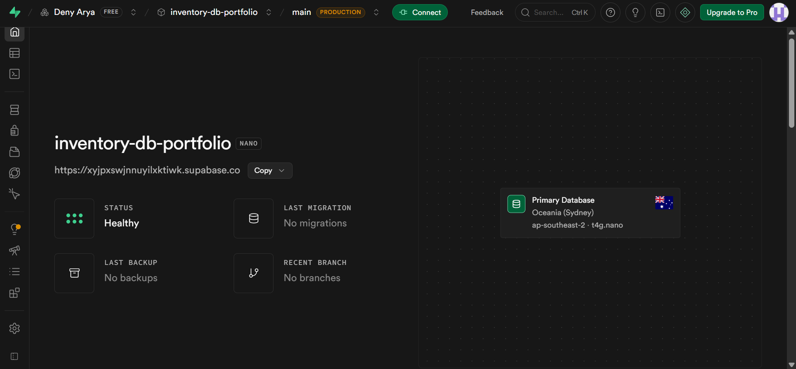
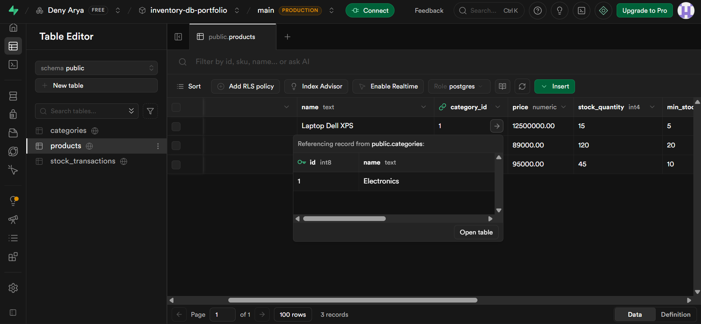
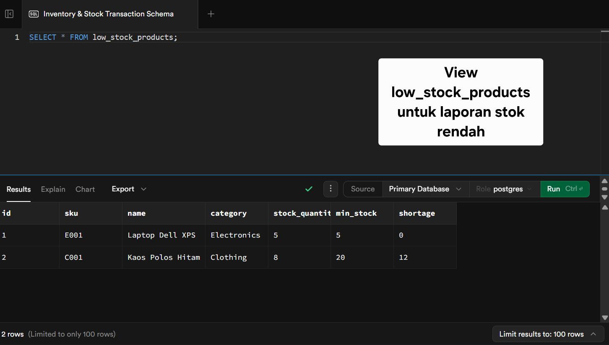
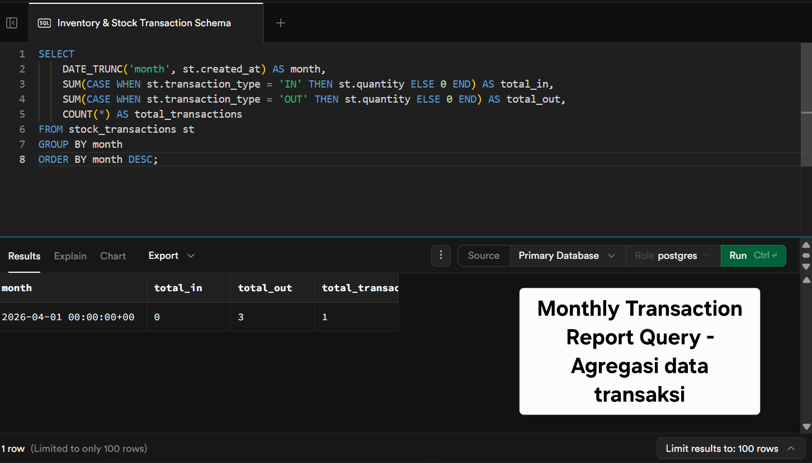

# Inventory Management Database

**Portfolio Project - Aspiring Junior Database Administrator**

Proyek ini dibangun menggunakan **Supabase (PostgreSQL)** untuk mendemonstrasikan kemampuan database design, automation, dan best practices DBA.

### Fitur yang Diimplementasikan
- Normalized relational database schema (3NF)
- Proper indexing untuk meningkatkan performa query
- **Trigger + Function** untuk automatic stock update (business logic di database level)
- Row Level Security (RLS) enabled
- Custom View untuk laporan stok rendah
- Monthly transaction reporting query

### Technologies
- PostgreSQL (Supabase)
- SQL (Advanced)
- Trigger & Function
- AI Tools: Chat2DB / Cursor (untuk membantu generate & optimize query)

### Screenshot Project

### Cara Menjalankan Project
1. Clone repository
2. Jalankan `schema.sql`
3. Jalankan `seed.sql`
4. Test trigger dengan insert ke tabel `stock_transactions`
5. Lihat view: `SELECT * FROM low_stock_products;`

### Apa yang Saya Pelajari
- Pentingnya trigger untuk menjaga data consistency dan mengotomatisasi business process
- Penggunaan indexing dan view untuk meningkatkan performa dan kemudahan reporting
- Best practices schema design untuk aplikasi inventory management

---

**Aspiring Junior DBA | BNSP Junior Database Programmer**  
Final Year IT Student - Universitas Brawijaya
